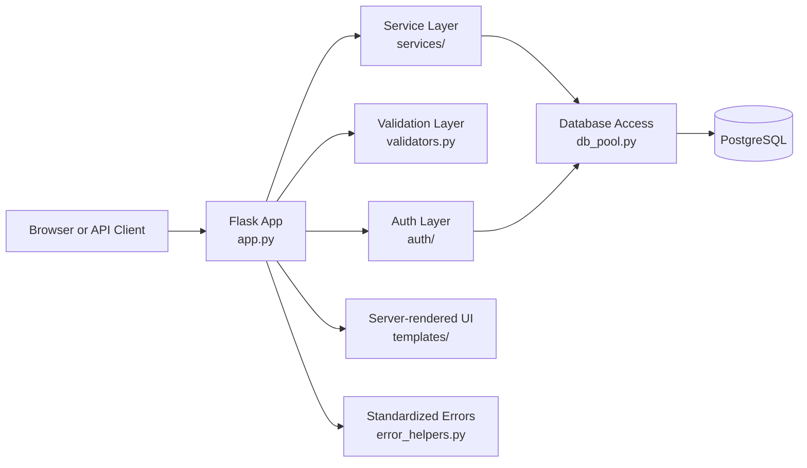

# Assessment Operations Platform

Sanitized public showcase of a Flask/PostgreSQL workflow platform focused on
API design, admin operations, authentication, validation, and secure backend
engineering.

This repository is extracted from a larger private application and intentionally
generalized for public sharing. It demonstrates the technical shape of the
system without exposing customer data, proprietary logic, or internal delivery
details.

## Why This Repo Exists

I wanted a public code sample that shows how I structure a non-trivial Python
web application when the original production project cannot be published in full.
The goal of this repo is to show implementation quality, architectural choices,
and operational thinking rather than disclose the original business context.

## What This Demonstrates

- Flask application design across API endpoints and server-rendered dashboard routes
- session-based admin authentication and API-key protected integrations
- service-layer decomposition for workflow-heavy route logic
- pooled PostgreSQL access and transaction helpers
- Pydantic-based request validation and standardized error responses
- security and operational concerns such as rate limiting, CORS, compression, and audit logging

## Representative Features

The published snapshot keeps several useful slices of the original codebase:

- admin login and protected dashboard flows
- role and catalog retrieval APIs
- access-request style approval and status-management workflows
- external integration endpoints with guarded request handling
- structured validation for nested payloads
- regression and startup checks for selected critical paths

The underlying business context has been deliberately generalized. The repo is
meant to be read as an engineering sample, not as a full product release.

## System Snapshot



## Code Layout

- `app.py`: application bootstrap, route registration, API guards, and core request flow
- `auth/`: login helpers, authorization checks, and audit-related utilities
- `services/`: business workflow logic extracted from route handlers
- `db_pool.py`: pooled database connections and transaction management helpers
- `validators.py`: request models and validation rules for public-facing and admin flows
- `templates/`: server-rendered dashboard and admin UI templates
- `tests/`: representative startup, validation, and regression coverage

## What Was Removed

This public snapshot intentionally excludes:

- customer data and operational exports
- secrets, credentials, and environment-specific deployment values
- proprietary prompts, private agent implementations, and internal notes
- confidential documentation and organization-specific process details
- the full schema, migrations, and seed data required to reproduce production

Because of that, this repository should be treated as a portfolio sample rather
than a fully reproducible product release.

## Running Locally

1. Create and activate a virtual environment.
2. Install dependencies.
3. Copy the example environment file and provide your own values.
4. Start the app.

```powershell
python -m venv .venv
.venv\Scripts\Activate.ps1
python -m pip install -r requirements.txt
Copy-Item .env.example .env
python app.py
```

The app expects a PostgreSQL database and tables compatible with the original
private project. The code is structurally valid, but the complete private schema
and deployment scaffolding are intentionally not published here.

## Docker

```powershell
docker build -t assessment-ops-showcase .
docker run --rm -p 5000:5000 --env-file .env assessment-ops-showcase
```

## Notes

- Optional integration routes referenced by the original app are intentionally omitted.
- Some tests assume a running local app and a database seeded with compatible records.
- The repository is curated to show engineering quality and system design, not to mirror the original system one-to-one.